# Policy-Deployment-Engine
The Policy Deployment Engine is designed to automate and simplify the enforcement of security policies across cloud environments, starting with Google Cloud Platform (GCP) 

The project focuses on developing a centralized system to efficiently deploy, manage, and update security policies, ensuring compliance and reducing manual effort. The engine aims to enhance security, improve operational efficiency, and provide organizations with a scalable solution for managing cloud policies by creating a structured approach to policy implementation. 

## Secure Source Manager overview
Secure Source Manager (SSM) on Google Cloud is a managed, secure source code repository solution with the following key characteristics:

Key Features - 
1. Regionally Deployed & Single-Tenant: Each instance of SSM is deployed to a specific Google Cloud region and is single-tenant, meaning it's isolated for security and performance.
2. Instance Accessibility: You can access your instance through a unique instance URI.
3. Repository Management: Repositories can be created and managed using either the web interface or the Secure Source Manager API.
4. Granular Permissions: Roles and permissions are distinctly defined for both:
5. Instances (managing the overall environment),
Repositories (controlling access to specific codebases).

## Resources
### A. google_secure_source_manager_instance
google_secure_source_manager_instance is a resource in Google Cloud that represents a dedicated, regional instance of Secure Source Manager, a managed Git repository service designed for security-sensitive environments.

#### Atrributes

##### 1. ca_pool 
(Certificate Authority Pool) is a resource used within Certificate Authority Service (CAS) to manage and issue digital certificates.
The policy validation included is to require the Secure Source Manager instance to use a trusted Certificate Authority (CA) pool.

`"private_config": [
                            {
                                "ca_pool": "projects/policy-depolyment/locations/australia-southeast2/caPools/my-ca-pool",
                                "is_private": true
                            }
                        ]`

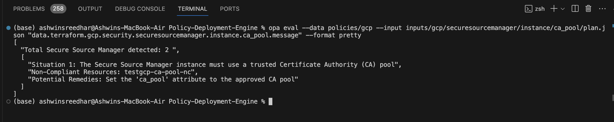

##### 2. kms_key
A cryptographic key managed by Cloud Key Management Service (Cloud KMS), used to perform cryptographic operations like encryption, decryption, signing, and verification.
 The validation will check fot the existence of company-managed KMS key to be configured to use with the Secure Source Manager instance.

`"kms_key": "company-provided-key"`

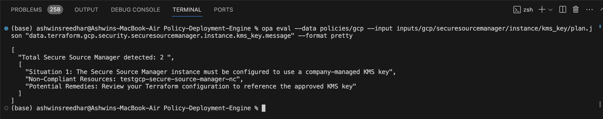

##### 3. private_config

A configuration setting that controls private access to an instance, so that the resource is available only within the VPC network.
This will improve security and compliance and the policy check is to make sure that this flag is set as true.

`"private_config": [
                            {
                                "ca_pool": "google_private",
                                "is_private": true
                            }
]`

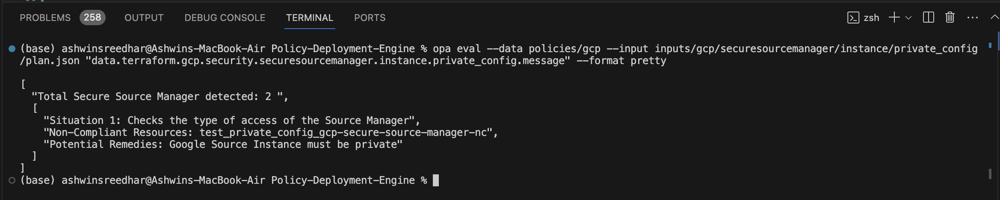

##### 4. workforce_identity_federation
Workforce Identity Federation lets you grant your non-Google identities (e.g. Okta/OIDC, Azure AD/SAML users) direct IAM access to a Secure Source Manager instance or its repositories. Our policy condition ensures that Workforce Identity Federation is enabled—which is a best practice for secure, centralized identity management.

`"workforce_identity_federation_config": [
                            {
                                "enabled": true
                            }
                        ]`

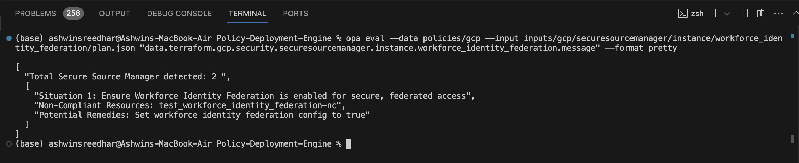

### B. google_secure_source_manager_repository
The **google_secure_source_manager_repository** is a resource in Google Cloud used to define and manage a Git repository within a Secure Source Manager (SSM) instance.

#### Atrributes

##### 1. default_branch

The **default_branch** refers to the primary Git branch that is checked out or referenced by default when users interact with the repository. The policy check is to ensure that the default branch for a Secure Source Manager repository is explicitly set to "main" in its initial configuration.

`"default_branch": "main"`

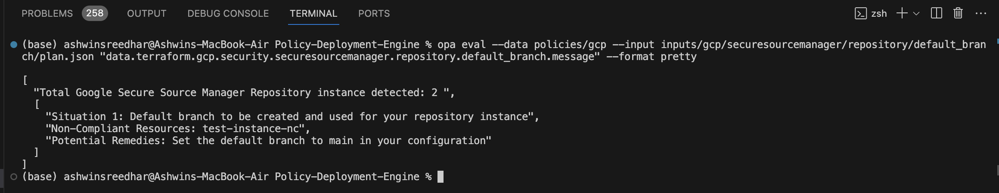

##### 2. description
A policy defines a check to ensure that a repository description is provided for a Secure Source Manager repository

 `"description": "This is the first repository"`

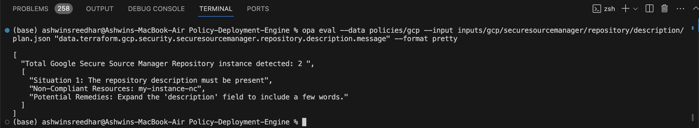

##### 3. gitignore
This specifies which .gitignore template to use for the repository. The policy provides a list of templates that are allowed to include in the configuration. This list can be updated as per the tech stack used.

`"gitignores": [
                                    "Bazel",
                                    "Cloud9"
                                ]`

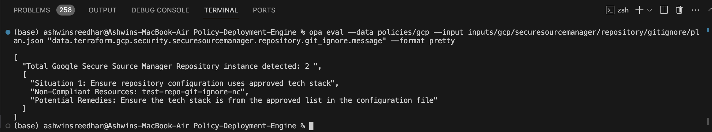

##### 4. license

This specfies the license template name a user can choose from. Allowed licenses are present in the list and can be updated as per the tech stack.

`"license": "mit"`

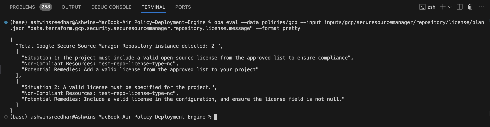

##### 5. readme 

The read me file helps in understanding the codebase and related information regarding intent, usage, installation and tesing instructions. The policy condition checks whether the requirement of this file in the repository is necessary or not. 

`"readme": "default"`

### C. google_secure_source_manager_branch_rule

**google_secure_source_manager_branch_rule** is a resource in Google Cloud's Secure Source Manager (SSM) that allows us to define rules for branch creation and management within a repository hosted in Secure Source Manager.

#### Atrributes

##### 1. minimum_approvals_count

The policy ensures that a minimum number of approvals is enforced before merging a branch in Google Secure Source Manager. Specifically, it checks that the minimum_approvals_count is set to at least 3. If the value is less than 3 or not set at all, the policy fails and recommends requiring approvals from at least three individuals to maintain code review integrity.

`"minimum_approvals_count": 3`

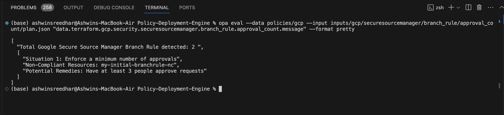

##### 2. require_comments_resolved

This enforces that all code review comments must be resolved before a pull request (or merge request) can be merged into a branch.
The policy enforces that all code review comments must be resolved before a branch can be merged in Google Secure Source Manager. It verifies that the **require_comments_resolved** attribute is explicitly set to true, ensuring no unresolved feedback is left behind. If this requirement is not enabled, the policy recommends turning it on to maintain review discipline and code quality.

`"require_comments_resolved": true`

##### 3. linear_history

In Google Secure Source Manager (GSSM), the linear_history setting in a branch rule enforces a linear commit history, meaning, all merges must be fast-forward merges, with no merge commits allowed.

This policy ensures that the **require_linear_history** setting is enabled for a branch in Google Secure Source Manager, enforcing a linear commit history. It checks that the branch only allows fast-forward merges by verifying the value is set to true. If not enabled, the policy recommends turning it on to simplify branch management and maintain a clean, consistent commit history.

`"require_linear_history": true`

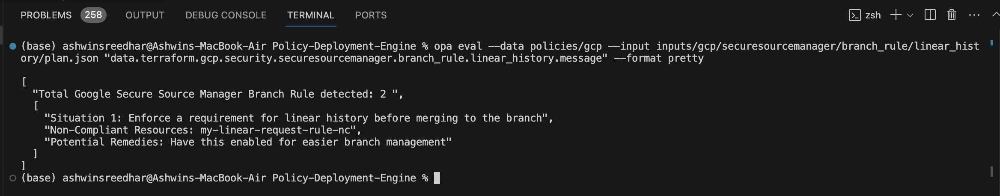

##### 4. pull_request

In Google Secure Source Manager (GSSM), the **pull_request** configuration within a branch rule defines rules and constraints for merging changes via pull requests. It helps enforce code quality, collaboration practices, and consistency before code is merged into protected branches.
The policy enforces that pull requests must be used before merging changes into a branch in Google Secure Source Manager. It checks that require_pull_request is not set to false, ensuring direct merges are blocked. If this requirement is missing or disabled, the policy suggests enabling it to promote code reviews, collaboration, and safer changes.

`"require_pull_request": true`

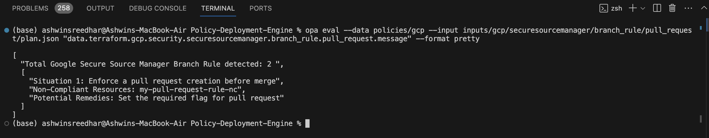

##### 5. reviews_count

To ensure that code changes are reviewed by a minimum number of people, enhancing quality, collaboration, and accountability.
In Google Secure Source Manager (GSSM), **reviews_count** typically refers to the number of approvals (code reviews) required before a pull request can be merged into a protected branch.

This policy enforces that a minimum of 2 code reviews must be completed before a branch can be merged in Google Secure Source Manager. It checks whether minimum_reviews_count is set to at least 2, flagging configurations where the value is lower or missing. If not enforced, the policy recommends requiring at least two reviewers to maintain strong review practices and code quality.

`"minimum_reviews_count": 2`

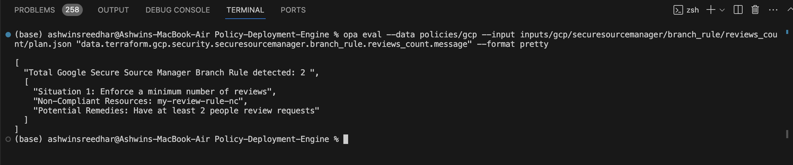

### D. google_secure_source_manager_instance_iam_binding
The **google_secure_source_manager_instance_iam_binding** resource in Terraform is used to manage IAM roles on a Secure Source Manager (SSM) instance in Google Cloud. It grants specific roles to one or more members at the instance level, controlling access and permissions for that SSM instance.

#### Atrributes

##### 1. role
The role attribute in the google_secure_source_manager_instance_iam_binding resource specifies the IAM role that is assigned to the listed members for the given Secure Source Manager (SSM) instance.

The policy ensures that the IAM role for Secure Source Manager (SSM) instances is correctly set to roles/secureSourceManager.instanceAccessor. It checks the role attribute and ensures that it matches the required value. If the role is set to something else, the policy recommends correcting it to roles/secureSourceManager.instanceAccessor and verifying the IAM configuration in the Terraform code.

`"role": "roles/secureSourceManager.instanceAccessor"`

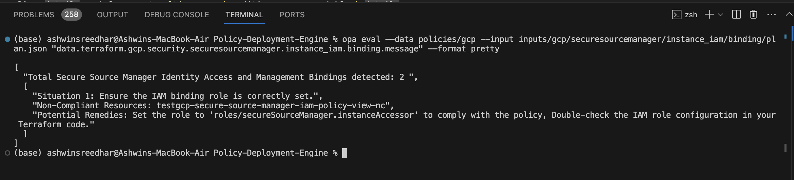

### D. google_secure_source_manager_instance_iam_policy

##### 1. policy_data

This is a resource in Terraform that allows you to set and manage IAM (Identity and Access Management) policies for a Secure Source Manager instance in Google Cloud. It defines which users, groups, or service accounts have specific roles and permissions for accessing and managing a Secure Source Manager instance.

The policy uses a "whitelist" approach, meaning only the specified role is allowed, and any deviation from this will trigger a violation. The purpose is to restrict access to the instance to view-only permissions, limiting it to the instanceAccessor role.

`"policy_data": "{\"bindings\":[{\"role\":\"roles/securesourcemanager.instanceAccessor\"}]}",`

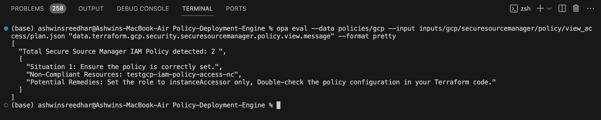